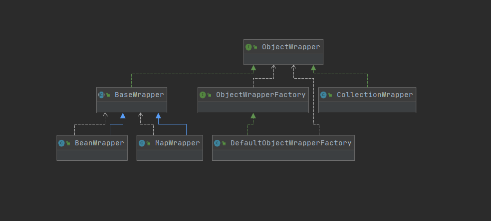

ObjectWrapper接口是对对象的包装，抽象了对象的属性信息，它定义了系列查询对象属性信息的方法，以及更新属性的方法。
 
```java
public interface ObjectWrapper {

  //如果ObjectWrapper中封装的是普通的Bean对象，则调用相应属性的相应getter方法
  //如果封装的是集合类，则获取指定key或下标对应的value值
  Object get(PropertyTokenizer prop);
  
  //如果ObjectWrapper中封装的是普通的Bean对象，则调用相应属性的相应setter方法
  //如果封装的是集合类，则设置指定key或下标对应的value值
  void set(PropertyTokenizer prop, Object value);

  //查找属性表达式指定的属性，第二个参数表示是否忽略属性表达式的下划线
  String findProperty(String name, boolean useCamelCaseMapping);

  //查找可写属性的名称集合
  String[] getGetterNames();

  //查找可读属性的名称集合
  String[] getSetterNames();

  //解析属性表达式指定属性的setter方法的参数类型
  Class<?> getSetterType(String name);

  //解析属性表达式指定属性的getter方法的参数类型
  Class<?> getGetterType(String name);

  //判断属性表达式指定属性是否有偶getter/setter方法
  boolean hasSetter(String name);
  boolean hasGetter(String name);

  //为属性表达式指定的属性创建相应的MetaObject对象
  MetaObject instantiatePropertyValue(String name, PropertyTokenizer prop, ObjectFactory objectFactory);
  
  //封装的对象是否为Collection对象
  boolean isCollection();
  
  // 调用Collection对象的add()/addAll()方法
  public void add(Object element);
  public <E> void addAll(List<E> element);

}
```
ObjectWrapperFactory负责创建ObjectWrapper对象:

 
 
DefaultObjectWrapperFactory实现了ObjectWrapperFactory接口，但他实现的getWrapperFor()方法始终抛出异常，hasWrapperFor()方法始终返回false,
所以该实现实际上是不可用得。但与ObjectFactory类型，我们可以在mybatis-config.xml中配置自定义的ObjectWrapperFactory实现类进行扩展。

BaseWrapper是一个实现了ObjectWrapper接口的抽象类，其中封装了MeteObject对象，并提供了三个常用的方法供其子类使用，如下图所示。
 
 
BaseWrapper的resolveCollection()方法会调用MeteObject.getValue()方法，它会解析属性表达式并获取指定的属性。
BaseWrapper的getCollection()方法和setCollection()方法会解析属性表达式的索引信息，然后获取/设置对应项，例如：
```java
public abstract class BaseWrapper implements ObjectWrapper {

  protected static final Object[] NO_ARGUMENTS = new Object[0];
  protected MetaObject metaObject;

  protected BaseWrapper(MetaObject metaObject) {
    this.metaObject = metaObject;
  }

  protected Object resolveCollection(PropertyTokenizer prop, Object object) {
    if ("".equals(prop.getName())) {
      return object;
    } else {
      return metaObject.getValue(prop.getName());
    }
  }

  protected Object getCollectionValue(PropertyTokenizer prop, Object collection) {
    if (collection instanceof Map) {
      return ((Map) collection).get(prop.getIndex());
    } else {
      int i = Integer.parseInt(prop.getIndex());
      if (collection instanceof List) {
        return ((List) collection).get(i);
      } else if (collection instanceof Object[]) {
        return ((Object[]) collection)[i];
      } else if (collection instanceof char[]) {
        return ((char[]) collection)[i];
      } else if (collection instanceof boolean[]) {
        return ((boolean[]) collection)[i];
      } else if (collection instanceof byte[]) {
        return ((byte[]) collection)[i];
      } else if (collection instanceof double[]) {
        return ((double[]) collection)[i];
      } else if (collection instanceof float[]) {
        return ((float[]) collection)[i];
      } else if (collection instanceof int[]) {
        return ((int[]) collection)[i];
      } else if (collection instanceof long[]) {
        return ((long[]) collection)[i];
      } else if (collection instanceof short[]) {
        return ((short[]) collection)[i];
      } else {
        throw new ReflectionException("The '" + prop.getName() + "' property of " + collection + " is not a List or Array.");
      }
    }
  }
}

```
BeanWrapper继承了BaseWrapper抽象类，其中封装了一个JavaBean对象以及该JavaBean类相应的MeteClass对象，当然，还有从BaseWrapper继承下来、该JavaBean对象
相应的MetaObject对象。
BeanWrapper.get()方法和set方法()会根据指定的属性表达式，获取/设置相应的属性值，两者逻辑类型，例如get()方法:

```java
public class BeanWrapper extends BaseWrapper {

  private Object object;
  private MetaClass metaClass;

  public BeanWrapper(MetaObject metaObject, Object object) {
    super(metaObject);
    this.object = object;
    this.metaClass = MetaClass.forClass(object.getClass(), metaObject.getReflectorFactory());
  }

  @Override
  public Object get(PropertyTokenizer prop) {
    //存在索引信息，则表示属性表达式中的name部分为集合类型
    if (prop.getIndex() != null) {
      //通过MetaObject.getValue()方法获取object对象中的指定集合属性
      Object collection = resolveCollection(prop, object);
      return getCollectionValue(prop, collection);
    } else {
      //不存在索引信息，则name部分为普通对象，查找并调用Invoker相关方法获取属性
      return getBeanProperty(prop, object);
    }
  }

  private Object getBeanProperty(PropertyTokenizer prop, Object object) {
      //根据属性名称,查找Reflector.getMethod集合中相应的GetFieldInvoker或者MethodInvoker
      Invoker method = metaClass.getGetInvoker(prop.getName());
      //获取属性值
      return method.invoke(object, NO_ARGUMENTS);
    }
}

```
CollectionWrapper跟MapWrapper就不提及了。