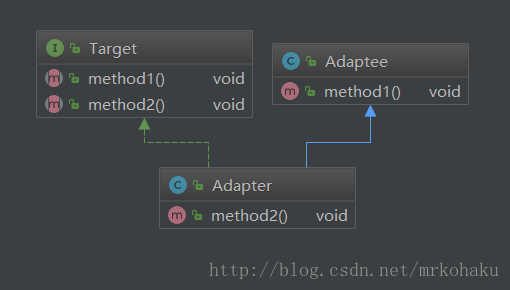
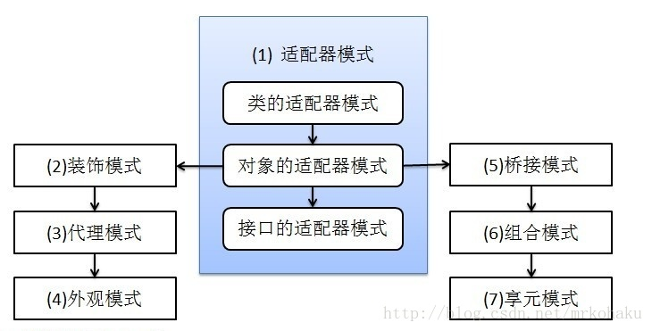
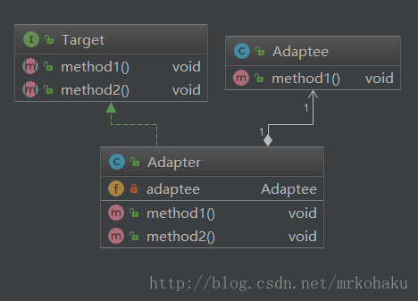

### JAVA设计模式——适配器模式

适配器模式是一种结构型设计模式。适配器模式的思想是：把一个类的接口变换成客户端所期待的另一种接口，从而使原本因接口不匹配而无法在一起工作的两个类能够在一起工作。

用电器来打个比喻：有一个电器的插头是三脚的，而现有的插座是两孔的，要使插头插上插座，我们需要一个插头转换器，这个转换器即是适配器。

适配器模式涉及3个角色:

     * 源（Adaptee）：需要被适配的对象或类型，相当于插头。
     * 适配器（Adapter）：连接目标和源的中间对象，相当于插头转换器。
     * 目标（Target）：期待得到的目标，相当于插座。
     
适配器模式包括3种形式：类适配器模式、对象适配器模式、接口适配器模式（或又称作缺省适配器模式）。

#### 类适配器模式
从下面的结构图可以看出，Adaptee类并没有method2()方法，而客户端则期待这个方法。为使客户端能够使用Adaptee类，我们把Adaptee与Target衔接起来。
Adapter与Adaptee是继承关系，这决定了这是一个类适配器模式。

 
 
 ```java
public class Adaptee {
    public void method1(){
        System.out.println("method 1");
    }
}

public interface Target {
    void method1();
    void method2();
}

public class Adapter extends Adaptee implements Target {
    @Override
    public void method2() {
        System.out.println("method 2");
    }
}

// 测试
class AdapterTest {
    public static void main(String[] args) {
        Adapter adapter = new Adapter();
        adapter.method1();
        adapter.method2();
    }
}

method 1
method 2

```
#### 对象适配器模式

对象适配器模式是另外6种结构型设计模式的起源。

 
 
 从下面的结构图可以看出，Adaptee类并没有method2()方法，而客户端则期待这个方法。与类适配器模式一样，为使客户端能够使用Adaptee类，我们把Adaptee与Target衔接起来。但这里我们不继承Adaptee，而是把Adaptee封装进Adapter里。这里Adaptee与Adapter是组合关系

 
 
 ```java
public class Adapter implements Target {

    private Adaptee adaptee;

    public Adapter(Adaptee adaptee) {
        this.adaptee = adaptee;
    }

    @Override
    public void method1() {
        adaptee.method1();
    }

    @Override
    public void method2() {
        System.out.println("method 2");
    }

}

class AdapterTest {
    public static void main(String[] args) {
        Adapter adapter = new Adapter(new Adaptee());
        adapter.method1();
        adapter.method2();
    }
}
method 1
method 2

```
#### 类适配器与对象适配器的区别

类适配器使用的是继承的方式，直接继承了Adaptee，所以无法对Adaptee的子类进行适配。

对象适配器使用的是组合的方式，·所以Adaptee及其子孙类都可以被适配。另外，对象适配器对于增加一些新行为非常方便，而且新增加的行为同时适用于所有的源。

基于组合/聚合优于继承的原则，使用对象适配器是更好的选择。但具体问题应该具体分析，某些情况可能使用类适配器会适合，最适合的才是最好的。

