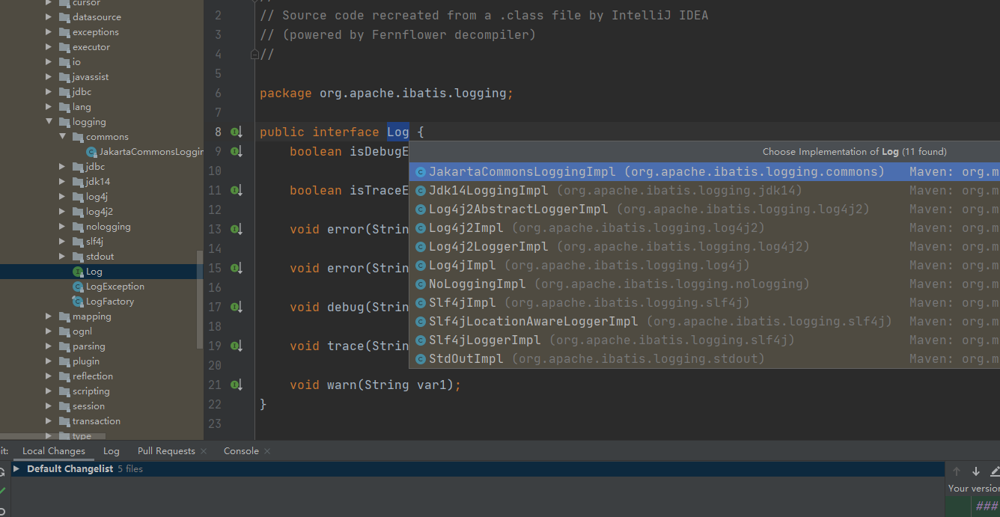

### 日志适配器

 第三方日志组件都有各自的Log级别，且都有所不同，例如java.util.logging提供了ALL，FINEST,FINER,FINE,CONFIG,INFO,WARNING等9个级别，
 而Log4j2则只有trace，info,warn，error,fatal这6中日志级别，Mybatis同意提供了trace,debug,warn，error四个级别，这基本与主流日志框架的
 日志级别类型，可以满足绝大多数场景的日志需求。
 
 Mybatis的日志模块位于org.appache.ibatis.logging包中，该模块中通过Log接口定义了日志模块的功能，当然日志适配器也会实现接口。LogFactory工厂
 会负责创建对应的日志组件适配器，如图:
 
  
  
  在LogFactory类加载是会执行静态代码块，其逻辑是按序加载并实例化对应日志组件的适配器，然后使用LogFactory.logConstructor这个惊天字段。记录当前使用的
  第三方日志组件的适配器，具体代码如下:
  
  ```java
public final class LogFactory {

  /**
   * 记录当前使用的第三方日志组件所对象的适配器构造方法
   */
  private static Constructor<? extends Log> logConstructor;

  static {
    //下面会针对每种日志组件调用tryImplementation()方法进行尝试加载，具体调用顺序
    //useSlf4jLogging()-->useCommonsLogging()-->useLog4J2Logging()
    //useLog4JLogging()-->useJdkLogging()-->useNoLogging()

    //其中，调用useJdkLogging()方法的代码如下:
      tryImplementation(Runnable runnable) {
        if (logConstructor == null) {
          try {
            useJdkLogging();
          } catch (Throwable t) {
            // ignore
          }
        }
      }
    //...调用上述每个use*()方法的代码都与调用useJdkLogging()方法类似
  }
}
```
LogFactory.tryImplementation()方法首先会检查logConstructor字段，若为空则调用Runnable.run()方法，不是start()方法，如上其中会调用
use*Logging()方法。具体代码如下：

```java
  public static synchronized void useJdkLogging() {
    setImplementation(org.apache.ibatis.logging.jdk14.Jdk14LoggingImpl.class);
  }

  private static void setImplementation(Class<? extends Log> implClass) {
    try {
      //霍去病指定适配器的构造方法
      Constructor<? extends Log> candidate = implClass.getConstructor(String.class);
      Log log = candidate.newInstance(LogFactory.class.getName());
      if (log.isDebugEnabled()) {
        //输出日志
        log.debug("Logging initialized using '" + implClass + "' adapter.");
      }
      logConstructor = candidate;//初始化logConstructor字段
    } catch (Throwable t) {
      throw new LogException("Error setting Log implementation.  Cause: " + t, t);
    }
  }
```

Jdk14LoggingImpl实现了org.apache.ibatis.logging.Log接口，并封装了java.util.logging.Logger对象,org.apache.ibatis.logging.Log接口的功能
全部通过调用java.util.logging.Logger对象实现，这与前面介绍的适配器模式完全一致，Jdk14LoggingImpl的实现如下：

```java
public class Jdk14LoggingImpl implements Log {

  private final Logger log;//底层封装的java.util.logging.Logger对象

  public Jdk14LoggingImpl(String clazz) {
    log = Logger.getLogger(clazz);
  }

  @Override
  public boolean isDebugEnabled() {
    return log.isLoggable(Level.FINE);
  }

  @Override
  public boolean isTraceEnabled() {
    return log.isLoggable(Level.FINER);
  }

  @Override
  public void error(String s, Throwable e) {
    log.log(Level.SEVERE, s, e);
  }

  @Override
  public void error(String s) {
    log.log(Level.SEVERE, s);
  }

  @Override
  public void debug(String s) {
    log.log(Level.FINE, s);
  }

  @Override
  public void trace(String s) {
    log.log(Level.FINER, s);
  }

  @Override
  public void warn(String s) {
    log.log(Level.WARNING, s);
  }

}

```
