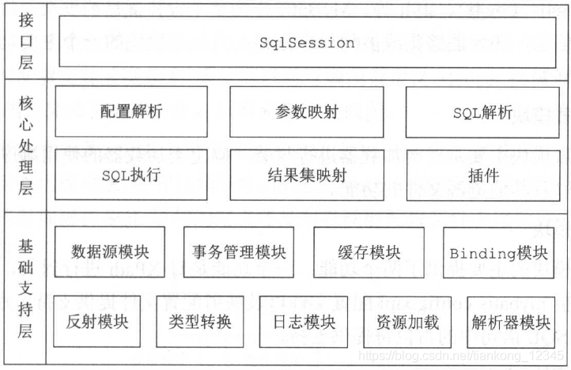
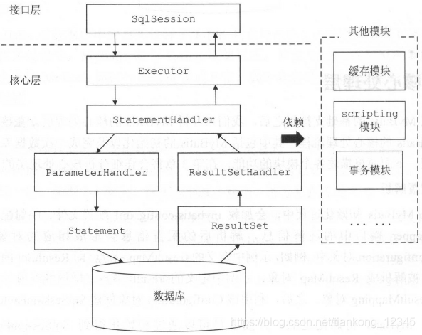
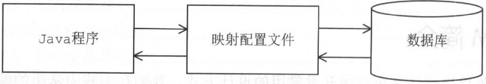

#### MyBatis 的整体架构分为三层， 分别是基础支持层、核心处理层和接口层:



##### 一.基础支撑层（各个模块的功能）

|  |   |
| ------ |  ------ |
| 反射模块  | 该模块对Java 原生的反射进行了良好的封装，提供了更加简洁易用的API ，方便上层使调用，并且对反射操作进行了一系列优化，<br>例如缓存了类的元数据，提高了反射操作的性能。 |
| 类型转换模块 | 别名机制，该机制是类型转换模式的主要功能之一。<br>实现JDBC类型与Java类型之间的转换，该功能在为SQL语句绑定实参以及映射查询结果集时都会涉及。 |
| 日志模块  |  提供详细的日志输出信息。<br>能够集成多种日志框架，例如Log-4j，slf4j等，其日志模块的一个主要功能就是集成第三方日志框架。 |
| 资源加载模块 |  对类加载器进行封装，确定类加载器的使用顺序，并提供了加载类文件以及其他资源文件的功能。 |
| 解析器模块 |  对XPath 进行封装，为MyBatis 初始化时解析mybatis-config.xml 配置文件以及映射配置文件提供支持;<br> 为处理动态SQL 语句中的占位符提供支持。 |
| 数据源模块 |  自身提供了相应的数据源实现。提供了与第三方数据源集成的接口。 |
| 事务管理 | Mybatis对数据库的事务进行了抽象，其自身提供了相应事务接口和简单实现。  |
| 缓存模块 | MyBatis中提供了一级缓存和二级缓存，而这两级缓存都是依赖于基础支持层中的缓存模块实现的。<br>MyBatis 中自带的这两级缓存与MyBatis 以及整个应用是运行在同一个JVM中的，共享同一块堆内存。<br>如果这两级缓存中的数据量较大， 则可能影响系统中其他功能的运行，所以当需要缓存大量数据时，优先考虑使用Redis 、Memcache 等缓存产品。
| Binding模块 | MyBatis通过该模块将用户自定义的Mapper接口与映射文件关联起来，系统通过调用自定义Mapper接口中的方法执行相应的SQL语句完成数据库操作。<br> 开发人员无需编写自定义Mapper接口的实现，Mybatis会自动为其创建动态代理对象。  |

##### 二.基础支撑层（各个模块的功能）

|  |   |
| ------ |  ------ |
| 配置解析  | 在Mybatis初始化过程中，会加载mybatis-config.xml配置文件，映射文件以及mapper接口中的注解信息，解析后的配置信息会形成相应的对象保存与Configuration对象中。<br> 利用该Configuration对象创建SqlSessionFactory对象。<br>待Mybatis初始化之后，开发人员可以通过初始化得到SqlSessionFactory对象创建SqlSession对象并完成数据库操作。 |
| SOL解析与scripting 模块 | MyBatis实现动态SQL语句的功能，提供了多种动态SQL 语句对应的节点，例如，＜ where＞节点、＜ if>节点、＜ foreach＞节点等。通过这些节点的组合使用， 开发人员可以写出几乎满足所有需求的动态SQL语句。<br> MyBatis中的scripting 模块会根据用户传入的实参，解析映射文件中定义的动态SQL节点，并形成数据库可执行的SQL 语句。之后会处理SQL 语句中的占位符，绑定用户传入的实参。
| SOL执行 | SQL 语句的执行涉及多个组件，其中比较重要的是Executor 、StatementHandler 、ParameterHandler 和ResultSetHandler。<br> Executor主要负责维护一级缓存和二级缓存，并提供事务管理的相关操作，它会将数据库相关操作委托给StatementHandler 完成。<br>StatementHandler 首先通过ParameterHandler 完成SQL 语句的实参绑定；<br>然后通过java.sql.Statement 对象执行SQL 语句并得到结果集； 最后通过ResultSetHandler 完成结果集的映射，得到结果对象并返回。（看图）|

MyBatis 执行一条SQL 语句的大致过程:



##### 三.接口层

核心是SqlSession 接口，该接口中定义了MyBatis 暴露给应用程序调用的API ，也就是上层应用与MyBatis 交互的桥梁。接口层在接收到调用请求时，会调用核心处理层的相应模块来完成具体的数据库操作。

##### 四、ORM的来历
实际开发系统时，我们可通过JDBC完成多种数据库操作。这里以传统JDBC编程过程中的查询操作为例进行说明，其主要步骤如下：

（1）注册数据库驱动类，明确指定数据库 URL地址、数据库用户名、密码等连接信息。

（2）通过 DriverManager 打开数据库连接。

（3）通过数据库连接创建 Statement 对象。

（4）通过 Statement 对象执行SQL 语句，得到 ResultSet 对象。

（5）通过 ResultSet 读取数据，并将数据转换成 JavaBean  对象。

（6）关闭ResultSet 、Statement 对象以及数据库连接，释放相关资源。

上述步骤（1）到步骤（4） 以及步骤（6） 在每次查询操作中都会出现，在保存、更新、删除等其他数据库操作中也有类似的重复性代码。在实践中，为了提高代码的可维护性，可以将上述重复性代码封装到一个类似DBUtils 的工具类中。步骤5 中完成了关系模型到对象模型的转换，要使用比较通用的方式封装这种复杂的转换是比较困难的。



```java
        import java.sql.Connection;   
        import java.sql.DriverManager;   
        import java.sql.SQLException;   
        import java.sql.Statement;   
        public class JDBCMySQL {  
        public static final String DBDRIVER = "org.gjt.mm.mysql.Driver";   
        public static final String DBURL = "jdbc:mysql://localhost:3306/mydb";   
        //现在使用的是mysql数据库，是直接连接的，所以此处必须有用户名和密码   
        public static final String USERNAME = "root";   
        public static final String PASSWORD = "mysqladmin";   
        public static void main(String[] args) {   
                //数据库连接对象   
                Connection conn = null;   
                //数据库操作对象   
                Statement stmt = null;   
                //1、加载驱动程序   
                try {   
                        Class.forName(DBDRIVER);   
                } catch (ClassNotFoundException e) {   
                        e.printStackTrace();   
                }   
                //2、连接数据库   
                //通过连接管理器连接数据库   
                try {   
                        //在连接的时候直接输入用户名和密码才可以连接   
                        conn = DriverManager.getConnection(DBURL,USERNAME,PASSWORD);   
                } catch (SQLException e) {   
                        e.printStackTrace();   
                }   
                //3、向数据库中插入一条数据   
                String sql = "INSERT INTO person(name,age) VALUES ('Michael',20)";   
                try {   
                        stmt = conn.createStatement();   
                } catch (SQLException e) {   
                        e.printStackTrace();   
                }   
                //4、执行语句   
                try {   
                        stmt.executeUpdate(sql);   
                } catch (SQLException e) {   
                        e.printStackTrace();   
                }   
                //5、关闭操作，步骤相反哈~   
                try {   
                        stmt.close();   
                        conn.close();   
                } catch (SQLException e) {   
                        e.printStackTrace();   
                }   
        }   
}
```

##### 五、常见的持久化框架

1、Hibernate
Hibernate 通过hbm . xml 映射文件维护Java 类与数据库表的映射关系。

数据库中所有的表通过hbm皿nl 配置文件映射之后，都对应一个Java 类， 表中的每一行数据在运行过程中会被映射成相应的Java 对象。在Java 对象之间存在一对多、一对一、多对多等复杂的层次关系， Hibernate的hbm.xml 映射文件也可以维护这种层次关系， 并将这种关系与数据库中的外键、关联表等进行映射，这也就是所谓的“ 关联映射” 。

Hibernate 的互PI 没有侵入性，业务逻辑不需要继承Hibernate 的任何接口。

Hibernate默认提供了一级缓存和二级缓存，这有利于提高系统的性能，降低数据库压力。

很难修改Hibernate 生成的SQL 语句，当数据量比较大、数据库结构比较复杂时， Hibernate 生成SQL 语句会非常复杂，而且要让生成的SQL 语句使用正确的索引也比较困难，这就会导致出现大量慢查询的情况。

在有些大数据量、高并发、低延迟的场景下，Hibernate 并不是特别适合。

Hibernate 对批处理的支持并不是很友好，这也会影响部分性能。（出现了iBatis ( Mybatis 的前身）这种半自动化的映射方式来解决性能问题。）

2、JPA（Java Persistence API）
JPA 仅仅是一个持久化的规范，它并没有提供具体的实现。

JPA 规范的愿景很美好， 但是并没有得到很好的发展，现在在实践中的出场率也不是很高。

3、Spring JDBC
严格来说， Spring JDBC 并不能算是一个ORM 框架，它仅仅是使用模板方式对原生JDBC进行了一层非常薄的封装。

Spring JDBC 中没有映射文件、对象查询语言、缓存等概念，而是直接执行原生SQL 语句。

Spring JDBC 本身就位于Spring 核心包中，也是Spring 框架的基础模块之一，天生与Spring 框架无缝集成。

4、MyBatis
相较于Hibernate, MyBatis 更加轻量级，可控性也更高，在使用MyBatis 时我们直接在映射配置文件中编写待执行的原生SQL 语句，这就给了我们直接优化SQL 语句的机会，让SQL语句选择合适的索引，能更好地提高系统的性能，比较适合大数据量、高并发等场景。

在编写SQL 语句时，我们也可以比较方便地指定查询返回的列，而不是查询所有列并映射对象后返回，这在列比较多的时候也能起到一定的优化效果。

5、总结

（1）性能角度
Hibernate 生成的SQL 语句难以优化；

SpringJDBC 和MyBatis 直接使用原生SQL 语句，优化空间比较大；

My Batis 和Hibernate 有设计良好的缓存机制， 三者都可以与第三方数据源配合使用；

（2）可移植性
Hibernate 帮助开发人员屏蔽了底层数据库方言，而Spring JDBC 和My Batis 在该方面没有做很好的支持，但实践中很少有项目会来回切换底层使用的数据库产品，所以这点并不是特别重要；

（3）开发效率
Hibernate 和MyBatis 都提供了XML 映射配置文件和注解两种方式实现映射， Spring JDBC 则是通过ORM化的Callback 的方式进行映射。

